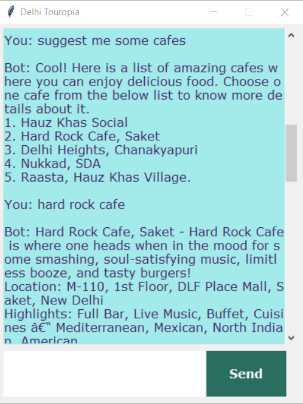

# What is Chatbot?
A chatbot is an intelligent piece of software that is capable of communicating and performing actions similar to a human. Chatbots are used a lot in customer interaction, marketing on social network sites and instantly messaging the client. There are two basic types of chatbot models based on how they are built; Retrieval based and Generative based models.

1. Retrieval based Chatbots
A retrieval-based chatbot uses predefined input patterns and responses. It uses some type of heuristic approach to select the appropriate response. It is widely used in the industry to make goal-oriented chatbots where we can customize the tone and flow of the chatbot get the best experience.

2. Generative based Chatbots
Generative models are not based on some predefined responses.
They are based on sequence 2 sequence neural networks. It is the same idea as machine translation.  
  


# About project - Delhi Touropia
We have created a chatbot named Delhi Touropia using deep learning techniques. This bot will chat with user to suggest him/ her best places in and around Delhi. It will show description of Hotels, Places, Cafés. 
 
The chatbot will be trained on the dataset which contains categories, pattern and responses. We use a special recurrent neural network (LSTM) to classify which category the user’s message belongs to and then we will give a random response from the list of responses. 
   



## Dataset

The dataset we will be using is `intents.json`. This is a JSON file that contains the patterns we need to find and the responses we want to return to the user.  

## Prerequisites

The project requires you to have good knowledge of 
[Python](https://www.python.org/about/gettingstarted/), 
[Keras](https://keras.io/getting_started/intro_to_keras_for_engineers/), and [Natural language processing (NLTK)](https://www.nltk.org/). 
Along with them, we will use some helping modules which you can download using the python-pip command.
Use the package manager [pip](https://pip.pypa.io/en/stable/) to install following modules.  
1. [Tensorflow](https://www.tensorflow.org/api_docs)
2. [Keras](https://keras.io/api/)
3. [Pickle](https://docs.python.org/3/library/pickle.html)
4. [NLTK](https://www.nltk.org/)

```
pip install tensorflow, keras, pickle, nltk
```
## How to make chatbot ?
### File structure and the type of files used in project are as follows:
- ***Intents.json*** – The data file which has predefined patterns and responses.
- ***train_chatbot.py*** – In this Python file, we wrote a script to build the model and train our chatbot.
- ***Words.pkl*** – This is a pickle file in which we store the words Python object that contains a list of our vocabulary.
- ***Classes.pkl*** – The classes pickle file contains the list of categories.
- ***Chatbot_model.h5*** – This is the trained model that contains information about the model and has weights of the neurons.
- ***Chatgui.py*** – This is the Python script in which we implemented GUI for our chatbot. Users can easily interact with the bot.    


## Steps to create a chatbot in Python from scratch:
1. Import and load the data file
2. Preprocess data
3. Create training and testing data
4. Build the model
5. Predict the response

# 1. Import and load the data file
First, make a file name as train_chatbot.py. We import the necessary packages for our chatbot and initialize the variables we will use in our Python project.

The data file is in JSON format so we used the json package to parse the JSON file into Python.  
  
  
This is how intent.json file looks  
  

# 2. Data Preprocess
When working with text data, we need to perform various preprocessing on the data before we make a machine learning or a deep learning model. Tokenizing is the most basic and first thing you can do on text data. `Tokenizing` is the process of breaking the whole text into small parts like words.  
After Tokenizing, we will lemmatize each word and remove duplicate words from the list. `Lemmatizing` is the process of converting a word into its lemma form and then creating a pickle file to store the Python objects which we will use while predicting.
# 3. Create training and testing data
we will create the training data in which we will provide the input and the output. Our input will be the pattern and output will be the class our input pattern belongs to. But the computer doesn’t understand text so we will convert text into numbers.
# 4. Build the model
After training data ready, now we will build a deep neural network that has 3 layers. We use the Keras sequential API for this. After training the model for 200 epochs, we achieved 100% accuracy on our model. Let us save the model as ‘chatbot_model.h5’.
# 5. Predict the response
We will load the trained model and then use a graphical user interface that will predict the response from the bot. The model will only tell us the class it belongs to, so we will implement some functions which will identify the class and then retrieve us a random response from the list of responses.  
Now we will code a graphical user interface. For this, we use the Tkinter library which already comes in python. We will take the input message from the user and then use the helper functions we have created to get the response from the bot and display it on the GUI.
# 6. Run the chatbot
To run the chatbot, we have two main files; train_chatbot.py and chatapp.py.  

First, we train the model using the command in the terminal:  
```python train_chatbot.py```  
If you have successfully created the model. Then to run the app, we run the second file.

```python chatgui.py```  
The program will open up a GUI window within a few seconds. With the GUI you can easily chat with the bot.  
