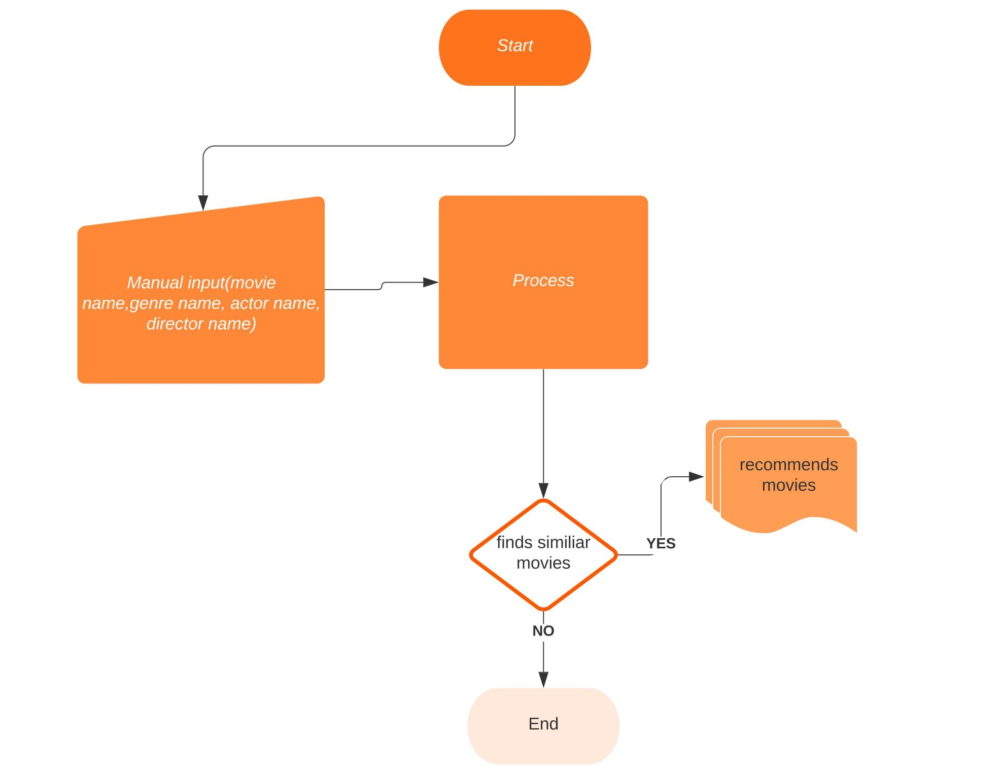

# ds-cp-6

## Movie Recommendation System

## How to Run 
1. Download the zip file. <a href ="https://github.com/B-UDAY-CHANDRA-001/hollywood-movie-recommendation-system/archive/main.zip" >Click Here</a></h3>
  - Go to the movie_recommd-main and do `pip install -r requirements.txt`(cmd prompt)
2. flask run.

## About project

- Movie recommendation system based on content based filtering.
  - Content-based filtering uses item features to recommend other items similar to what the user likes, based on their previous actions or explicit feedback.

- Data set is created by ourself.
  - Dataset used : <a href ="https://www.kaggle.com/udaychandra/hollywood-movies" >get from here</a></h3>
 ## Team info:
 - B.UDAY CHANDRA
 - SACHIN
 
 ## WorkFlow:
 
 
